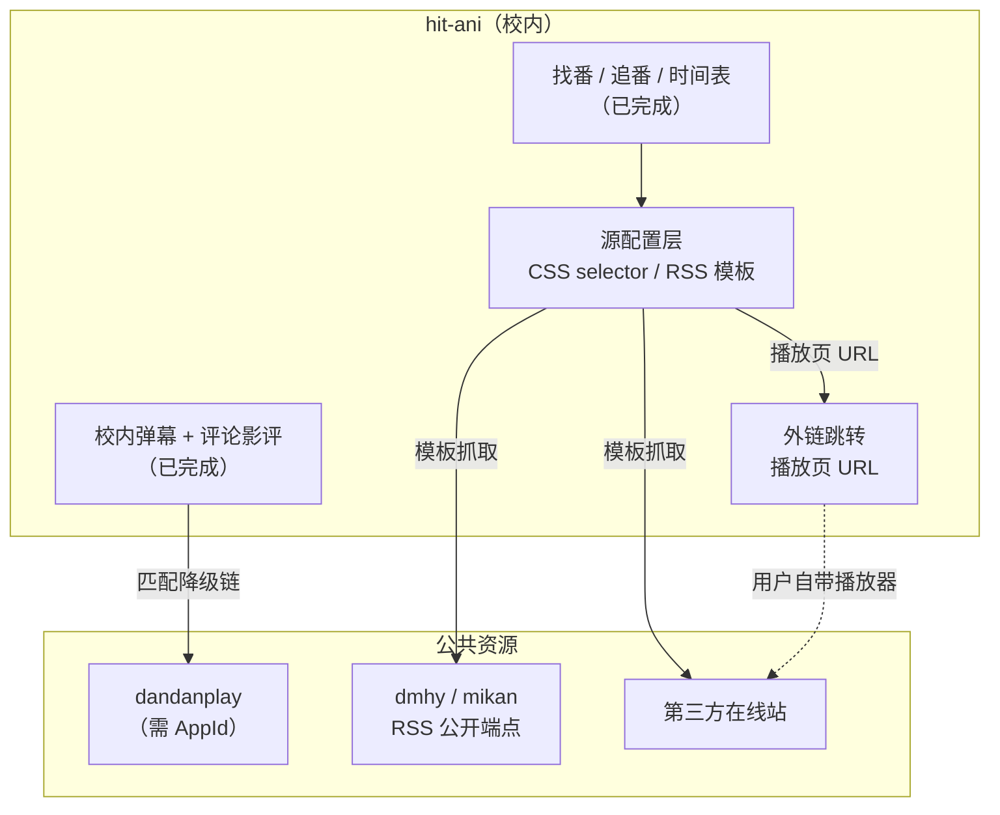

# 视频获取 / 播放 / 弹幕源 —— Animeko 调研与 hit-ani 设计决策

> 调研对象：[`open-ani/animeko`](https://github.com/open-ani/animeko) `main`（tree sha `446e34e`）、
> [`open-ani/mediamp`](https://github.com/open-ani/mediamp)。全部结论附文件路径与源码片段，只读调研。
>
> 本文档回答两个问题：**Animeko 怎么拿视频、怎么播**；**hit-ani 该抄什么、不该抄什么**。

---

## 0. 三句话结论

1. **视频源不是某个私有播放 API，而是「订阅一堆源配置 + 按 CSS selector / RSS 抓取」的通用引擎。**
   所谓「在线聚合源」= ani-subs 发布的一份 JSON 配置列表，客户端拿它去抓 HTML 与 RSS。这意味着
   hit-ani 可以完全自研同类能力，不必依赖任何第三方服务。
2. **BT 源走公开端点**（蜜柑 `mikanani.me`、动漫花园 `dmhy.org`），下载靠 libtorrent；
   但 **hit-ani 不应自建 BT 引擎**（见 §5 的三条硬理由）。
3. **弹幕源（dandanplay）需要 AppId/AppSecret，且签名算法固定**：`Base64(SHA256(appId + ts + path + secret))`。
   其**匹配降级链**（id 映射 → 季度别名 → 名称搜索 → 文件名 match）是可直接复用的精华，
   已实现为 `src/lib/danmaku/matching.ts`。

---

## 1. Animeko 的真实模块结构（纠正旧认知）

**注意**：网上流传的 `datasource/{bt,online,jellyfin,emby,custom,media-selector}` 结构**已过时**。
main 上 **不存在** `online/`、`custom/`、`emby/`、`media-selector/` 目录。

| 路径 | 职责 | 关键类型 |
| --- | --- | --- |
| `datasource/api` | 数据源**接口与核心模型** | `Media`, `MediaSource`, `MediaFetchRequest`, `ResourceLocation` |
| `datasource/core` | 数据源管理器 | `MediaFetcher`, `MediaCacheStorage` |
| `datasource/bt/dmhy` | 动漫花园 BT 源 | `DmhyMediaSource`, `Network`, `ListParser` |
| `datasource/bt/mikan` | 蜜柑计划 BT 源 | `MikanMediaSource`, `MikanCNMediaSource` |
| `datasource/jellyfin` | Jellyfin **与 Emby**（同模块子类） | `BaseJellyfinMediaSource`, `EmbyMediaSource` |
| `datasource/ikaros` | Ikaros CMS 媒体库 | `IkarosMediaSource` |
| `app/shared/app-data/…/mediasource/web` | **通用 CSS Selector 在线源** | `SelectorMediaSource` (`web-selector`) |
| `app/shared/app-data/…/mediasource/rss` | **通用 RSS BT 源** | `RssMediaSource` (`rss`) |
| `app/shared/app-data/…/media/selector` | 自动选源 | `MediaAutoSelector`, `MediaSelectionDecider` |
| `app/shared/app-data/…/media/resolver` | 资源 → 可播放数据 | `TorrentMediaResolver`, `HttpStreamingMediaResolver` |
| `torrent/anitorrent` | 基于 libtorrent 的原生 BT 引擎 | Anitorrent |
| `danmaku/{api,ui,ui-config,dandanplay}` | 弹幕（自研 Compose Canvas，非第三方库） | `DanmakuInfo`, `DanmakuHostState` |
| `client` | OpenAPI 生成的**自建服务**客户端 | `DanmakuAniApi` |

**核心数据模型**（`datasource/api/.../Media.kt`）：

```kotlin
sealed interface Media {
    val mediaId: String          // 全局唯一 "<mediaSourceId>.<id>"；稳定，用于去重
    val download: ResourceLocation
    val episodeRange: EpisodeRange?   // 包含的剧集（合集/单集/季）
    val properties: MediaProperties   // 分辨率/字幕语言/字幕组/大小
    val kind: MediaSourceKind         // WEB | BitTorrent | LocalCache
}

sealed interface ResourceLocation {
    // MagnetLink | HttpTorrentFile | HttpStreamingFile | WebVideo | LocalFile
}
```

> 注：**不存在** `WebVideoFile` 类型。最接近的是 `ResourceLocation.WebVideo`（播放页 URL，需 WebView 解析）
> 与 `ResourceLocation.HttpStreamingFile`（m3u8/mp4 直链）。

---

## 2. 在线源：怎么取数据

「在线聚合源」的真相：**不是 REST 播放 API，而是配置驱动的抓取**。

`SelectorMediaSource`（factoryId `web-selector`）的关键实现：

```kotlin
val searchUrl = searchConfig.searchUrl.replace(
    "{keyword}",
    MediaSourceEngineHelpers.encodeUrlSegment(
        MediaSourceEngineHelpers.getSearchKeyword(query.subjectName, ...)))
val originalSubjects = fetchPageOrThrow(searchUrl, PageExpectation.SearchResults(searchConfig))
```

- 引擎 5 步：`searchSubjects → selectSubjects → searchEpisodes → selectEpisodes → selectMedia`
- 播放期再 `extractVideo`（WebView 拦截视频 URL）+ `matchWebVideo`（正则）
- 请求 = 普通 HTTP GET 拿 **HTML**，用 CSS selector / JsonPath / 正则解析；**无固定 schema**
- 默认无鉴权；遇验证码走 `WebSessionManager`（MacCMS 图片协议 → WebView + ONNX）

配置模型（`SelectorSearchConfig`）值得直接借鉴的字段：

```kotlin
data class SelectorSearchConfig(
    val searchUrl: String,                 // 含 {keyword}
    val searchUseOnlyFirstWord: Boolean,
    val rawBaseUrl: String,
    val requestInterval: Duration = 3.seconds,
    val searchCacheTtl: Duration = 2.hours,
    val subjectFormatId: SelectorFormatId,  // a | indexed | json-path-indexed
    val channelFormatId: SelectorFormatId,  // no-channel | index-grouped
    val matchVideo: MatchVideoConfig,       // 播放期视频 URL 提取 + 请求头注入
)
```

`MatchVideoConfig` 定义防盗链透传：`cookies`、`addHeadersToVideo { referer, userAgent }`。

**BT 源的公开端点**（可直接用）：

```
蜜柑   https://mikanani.me/RSS/Bangumi?bangumiId={id}
       https://mikanani.me/RSS/Search?searchstr={kw}
       https://mikanani.me/Home/Search?searchstr={kw}
动漫花园 http://www.dmhy.org/topics/list?keyword={kw}&sort_id=2&team_id={id}&order=date-asc
       分页：/topics/list/page/{n}
```

**自动选源**（4 阶段 filter → sort → prefer → select）：

- 排序维度：资源类型（本地缓存最前）→ 下载代价（Local < Lan < Online）→ **tier** → 发布时间 → 名称相似度
- 偏好顺序：**分辨率 → 字幕语言 → 字幕组 → 数据源**
- 自动选择时序：本地缓存优先 → 记忆源 → `0~5s` 只收 tier0 精确匹配 → `5~15s` 收全部 tier 精确 → `≥15s` 才允许模糊
- ⚠️ **不做种数与评分排序**（`size` 字段存在但未参与排序）

---

## 3. 播放器：mediamp

自研抽象（独立仓库），**不是** expect/actual 小接口，而是带规格的状态机：

```kotlin
interface MediampPlayer : AutoCloseable {
    val state: StateFlow<PlayerState>          // 三轴：mediaStatus / playWhenReady / isBuffering
    val events: SharedFlow<PlaybackEvent>      // 边沿事件（含 MediaEnded），无 replay
    val currentPositionMillis: StateFlow<Long> // seek 时乐观更新
    val features: PlayerFeatures               // PlaybackSpeed / MediaMetadata(字幕轨/章节) 等
    suspend fun setMediaData(data: MediaData, playWhenReady: Boolean, startPositionMillis: Long)
    fun play(); fun pause(); fun seekTo(pos: Long); fun skip(delta: Long)
}
```

后端：Android `ExoPlayer` / 桌面 `MPV` / iOS `AVKit` / wasm `HTMLVideoElement`。
**VLC 已废弃**，spec v2 起由 MPV 取代。

> 对 hit-ani 的映射：Web 端用 `HTMLVideoElement` + ArtPlayer 管控制条，
> 关键是**分离两个时钟**（见下节）。

---

## 4. 弹幕：Animeko 的精髓在于「两个时钟」

这是本次调研**最有价值**的发现，直接决定 Web 实现是否正确。

| 时钟 | 来源 | 决定什么 |
| --- | --- | --- |
| **媒体时钟** | `player.currentPositionMillis` | 「该发哪条弹幕」 |
| **渲染时钟** | `withFrameNanos` 真实帧时间（墙钟） | 「弹幕滚了多远」 |

```kotlin
// FloatingDanmakuTrack.kt —— 位置是帧时间的纯函数，无累积误差
val distanceX: Float
    get() = ((frameTimeNanosState.longValue - placeFrameTimeNanos) / 1_000L) / 1_000_000f * speedPxPerSecond
```

**结论：弹幕滚动速度不随视频倍速变化。** `playbackSpeed` 只有一个用途 ——
换算 seek 后的重装填阈值（`3s × playbackSpeed`），**不做速度补偿**。

`DanmakuHostState` 完全不引用 `playbackSpeed`。

**轨道分配**（`FloatingDanmakuTrack.kt`）—— 可按此伪代码在 Web 复刻：

```
列表按 left 降序维护；插入时二分查找
willClash(prev, next) = prev.right()/prev.speed > next.left()/next.speed   // 追尾判定
isNonOverlapping: 检查矩形重叠 + 与左右邻居的追尾
速度 = base * pow(1.14, log2(width/baseWidth))    // 长弹幕更快
       * (1 + 随机 ±8.75%)                        // 避免叠影
```

- 轨道数 = `floor(height / trackHeight × displayArea)`，`displayArea` 默认 0.25
- 固定弹幕（TOP/BOTTOM）**每轨同时只显示 1 条**，显示 5000ms，有 pending 队列
- 溢出时 `trySend` **丢弃**该弹幕；用户自己发的 `send` 保底（延后放置）

**显示配置**（`DanmakuConfig`）：`speed=88dp/s`、`safeSeparation=36dp`、`displayArea=0.25`、
`enableColor`、`enableTop/Floating/Bottom`、`DanmakuStyle(fontSize=18sp, alpha=0.8, strokeWidth=4)`。

---

## 5. dandanplay：公共弹幕源的具体对接方式

**鉴权**（`DandanplayClient.kt`）：

```kotlin
header("X-AppId", appId)
val time = currentTimeMillis() / 1000          // 秒
header("X-Timestamp", time)
header("X-Signature", Base64(SHA256(appId + time + url.encodedPath + appSecret)))
```

**端点**（`api.dandanplay.net`）：

| 方法 | 路径 | 用途 |
| --- | --- | --- |
| GET | `/api/v2/bangumi/bgmtv/{bgmtvSubjectId}` | Bangumi subjectId → dandanplay 剧集（**首选**） |
| GET | `/api/v2/bangumi/season/anime/{year}/{month}` | 季度番剧列表（按别名精确匹配） |
| GET | `/api/v2/search/anime?keyword=` | 番剧搜索（404 视为空） |
| GET | `/api/v2/search/episodes?anime=&episode=` | 剧集搜索 |
| GET | `/api/v2/bangumi/{bangumiId}` | 详情 |
| POST | `/api/v2/match` | 文件名匹配（兜底） |
| GET | `/api/v2/comment/{episodeId}?chConvert=0&withRelated=true` | 取弹幕 |

**弹幕格式**（`p` 字段）：`出现时间秒,模式,颜色,用户ID`

```kotlin
location = when (mode.toIntOrNull()) {
    1 -> DanmakuLocation.NORMAL   // 滚动
    4 -> DanmakuLocation.BOTTOM
    5 -> DanmakuLocation.TOP
    else -> return null           // 其他模式直接丢弃
}
```

**匹配降级链**（源码注释原文）：

```
1. Bangumi subject id → 弹弹的 bgmtv 映射接口
2. 失败 → 取该番所属季度所有番名，匹配 Bangumi 条目所有别名
3. 失败 → 用番剧名搜索，匹配全部别名
4. 精确匹配到 → 获取该番所有剧集
5. 都没有 → 提交条目名给弹弹自行匹配（很不准）
剧集匹配：sort → ep → 集名精确 → Levenshtein 模糊
```

---

## 6. hit-ani 决策

### 6.1 抄什么

| 借鉴点 | 落点 | 状态 |
| --- | --- | --- |
| 弹幕匹配降级链 + Levenshtein | `src/lib/danmaku/matching.ts` | ✅ 已实现 |
| dandanplay 签名算法 | `src/lib/danmaku/dandanplay.ts` | ✅ 已实现 |
| 两个时钟分离（墙钟 vs 媒体钟） | 播放器实现时的硬性要求 | 📋 设计约束 |
| 轨道分配（`willClash` 追尾判定） | 现有 `allocateTracks` 升级 | 📋 见下 |
| `Media`/`ResourceLocation` 抽象 | `src/lib/media/types.ts` | ✅ 已实现 |
| 单源故障降级为空结果 | 多源聚合的容错原则 | 📋 设计约束 |
| 正则过滤 + 文本清洗 | 已有 `sanitizeDanmakuText`；正则待补 | 部分 |

### 6.2 **不**抄什么（附理由）

| 不抄 | 理由 |
| --- | --- |
| **BT 引擎（libtorrent/Anitorrent）** | ① 需要原生二进制与长期维护，Next.js 无法承载；② BT 协议在校内网大概率被墙，可用性差；③ **版权风险最高的一种形态** |
| 视频文件托管 | 带宽成本 + 版权风险，与「校内社交层」的核心价值无关（MVP 早已明确不做） |
| Animeko 自建弹幕服务（`api.animeko.org`） | 依赖第三方且发弹幕需 Animeko 账号 JWT，校内用户无法复用；有 SLA 风险 |
| ani-subs 订阅内容（`sub.creamycake.org`） | 第三方维护、站点持续变动；可借鉴 JSON 格式，不可依赖其可用性 |
| WebView 验证码识别链路（ONNX + JCEF） | 深度绑定桌面客户端，服务端无法复用 |

### 6.3 推荐路径：**不做视频托管，做「源配置 + 外链」**



**阶段划分**：

| 阶段 | 内容 | 状态 |
| --- | --- | --- |
| **M1** | 弹幕匹配链 + dandanplay 客户端 + `Media` 抽象 | ✅ 完成 |
| **M2** | 源配置层（`web-selector` / `rss`）+ 管理界面 + 试搜 | ✅ 完成（实测抓到真实资源） |
| **M3** | 播放器 + 弹幕渲染（两个时钟 + 轨道） | ✅ 完成（Jellyfin 直连播放） |
| **M4** | dandanplay 真实拉取 | ⏳ 未做，前置：申请 AppId/AppSecret |
| **M5** | 正版流媒体源（web-selector 指向授权站） | ✅ 已验证（巴哈姆特动画疯） |
| **M6** | 站内嵌入播放盗版站（需服务端代理 + 带宽） | ❌ 不做（带宽不足 + 平台成为分发方） |

### 重要区分：「外链跳转」与「嵌入播放」

两者常被混为一谈，但代价完全不同：

| | 外链跳转（已实现） | 嵌入播放（不做） |
| --- | --- | --- |
| 防盗链 Referer | **无影响**（用户跳到对方页面） | 必须伪造 |
| CORS | **无影响** | 需对方给头，盗版站不会给 |
| 带宽 | **零**（不走我们服务器） | 全部经过服务器 |
| 平台角色 | 索引 | 分发方 |

**「点击即看」在外链模式下是完全可行的**，且不需要任何代理 ——
只要源指向的是**有自己播放器的网站**（如正版流媒体站）。
磁力链接是唯一的例外：浏览器点它只会唤起 BT 客户端。

### BT 源的固有限制

`dmhy` / `mikan` 这类站给的是磁力链接，**无法在线看**。实测数据：
某条目 24 条资源全部是磁力，可点开 0 条。

因此界面把资源分成「可在线看」与「需下载」两类并分别计数，
在「可在线看」为 0 时给出明确指引 —— 而不是让用户点一堆没反应的链接。

### 为什么最终选了 Jellyfin（而不是抓第三方站）

你机器上实测：`<video>` 无法自定义 Referer，而盗版站普遍有防盗链 →
Web 端要播放必须走**服务端代理**，那样平台就从「索引」变成「传输方」。
Jellyfin 路径下视频由浏览器直连用户的媒体服务器，平台不碰字节流。

已交付的 Jellyfin 集成：

| 文件 | 职责 |
| --- | --- |
| `src/lib/media/jellyfin.ts` | 客户端：认证、搜索、剧集、直连地址生成（`static=true` 关转码） |
| `src/lib/media/jellyfin-service.ts` | 连接 CRUD + 条目匹配（复用弹幕的 Levenshtein 匹配） |
| `src/components/video-player.tsx` | 播放器 + 弹幕叠加层（两个时钟分离） |
| `src/components/jellyfin-panel.tsx` | 条目页「在这里看」面板 |
| `src/components/jellyfin-manager.tsx` | 连接管理 UI |
| `src/app/api/media/jellyfin/*` | 连接与库查询 API |

**实测验证**（真实 Jellyfin 12.1.0 容器）：
- 连通性探测 → `{"ok":true,"serverName":"hitani-lab","version":"12.1.0"}`
- 条目匹配 → `EXACT_NAME`（同名）/ `FUZZY` 距离 26（日文名 vs 英文名）
- 直连地址 → curl 返回 `991017 bytes` 的合法 MP4
- **token 不回显**（连接列表里只有非敏感字段）
- canvas 尺寸 `1398 = 1118 × 1.25` → 渲染循环确实在跑

**未能验证**：headless Chromium 不加载媒体（`readyState` 恒为 0），
因此「像素真正渲染出来」这一层需要真实浏览器确认。数据链路已证明可用：
同一 URL 在浏览器内 `fetch` 返回 `206 + video/mp4`。

### M2 已交付的模块

| 文件 | 职责 |
| --- | --- |
| `src/lib/media/url-safety.ts` | SSRF 防护：协议白名单、内网 IP 判定、**DNS 全解析校验**、fake-IP 受控放行 |
| `src/lib/media/source-config.ts` | 配置模型（zod）、关键词处理、URL 模板、内置预设 |
| `src/lib/media/extract.ts` | **纯函数**解析：CSS 选择器 / RSS / Atom / 正则提链 |
| `src/lib/media/fetcher.ts` | 网络层：**逐跳重定向校验**、超时、响应体上限、按 host 限速 |
| `src/lib/media/service.ts` | CRUD + 多源编排（单源失败不阻断） |
| `src/app/sources/page.tsx` + `components/source-manager.tsx` | 管理界面 + 试搜 |
| `src/app/api/media/sources` / `media/search` | API |

**三层分离是刻意的**：解析（`extract.ts`）不含 IO，因此站点改版时能立刻区分是「网络层坏了」还是「选择器过期了」，且 148 个单测全部离线可跑。

**实测**：真实抓取动漫花园 RSS 搜索「魔法少女」，1.3 秒返回字幕组资源；SSRF 成功拦截 `http://127.0.0.1:6379/` 这类内网目标。

**M3 的硬性设计约束**（来自 §4 调研）：

1. 弹幕位移用 `requestAnimationFrame` 的时间戳，**绝不用 `video.currentTime`**
2. 发弹幕的时机用 `video.currentTime`
3. 暂停时冻结渲染时钟（`play`/`pause`/`seeking`/`waiting` 事件）
4. `seeked` 事件触发重装填：用媒体时间差 **1:1** 反推放置时刻
5. 倍速**不补偿**弹幕速度（跟随 Animeko 行为；若产品要变，是明确的产品决策而非默认）
6. 不要用 DPlayer 内置弹幕 —— 其轨道/速度模型与上述不同，且无法分离两个时钟

### 6.4 版权边界（必须写进 README）

- hit-ani **不托管任何视频文件、不提供 BT 种子、不做种**
- 源配置层只保存「如何找到资源」的**规则**，不含资源本身
- 播放能力优先「跳转到用户自己的播放器/已有站点」，而非站内解析播放
- 弹幕与评论是校内 UGC，与视频源解耦（这也是当前架构的正确之处）

---

## 7. 落地物清单

| 文件 | 内容 | 验证 |
| --- | --- | --- |
| `src/lib/danmaku/dandanplay.ts` | dandanplay v2 客户端：签名、7 个端点、`p` 字段解析 | 签名与解析单测 |
| `src/lib/danmaku/matching.ts` | Levenshtein + 5 级降级匹配链 | 匹配优先级单测 |
| `src/lib/media/types.ts` | `Media` / `ResourceLocation` / `MediaSourceKind` 抽象 | 类型检查 |
| `tests/dandanplay-signature.test.ts` | 签名算法、`p` 解析、模式映射 | `npm test` |
| `tests/danmaku-matching.test.ts` | 降级链顺序、模糊匹配兜底、边界 | `npm test` |
| `docs/MEDIA.md` | 本文档 | — |

---

## 8. 明确未找到证据的点

1. `ServerListFeatureConfig.MAGIC_ANI_SERVER` 的实际取值（源文件 404，疑似构建期生成）
2. Animeko 自建弹幕服务的**服务端实现**（AGENTS.md 指向 `../ani-api-server`，公网 404）；
   其限流与内容审核策略不可得
3. `danmaku-cn.myani.org` / `danmaku-global.myani.org` 的实际用途（定义了但未找到使用点）
4. libtorrent 顺序下载/预读缓冲的具体配置
5. `mediamp` 的 `TrackGroup<T>` 成员签名
6. 外部播放器 / DLNA / 投屏：**明确无证据**（检索全仓无相关代码，Animeko 不做投屏）
7. 倍速下 seek 重装填的 1:1 时间映射是否导致位置偏差（源码未补偿，标注为推断）
