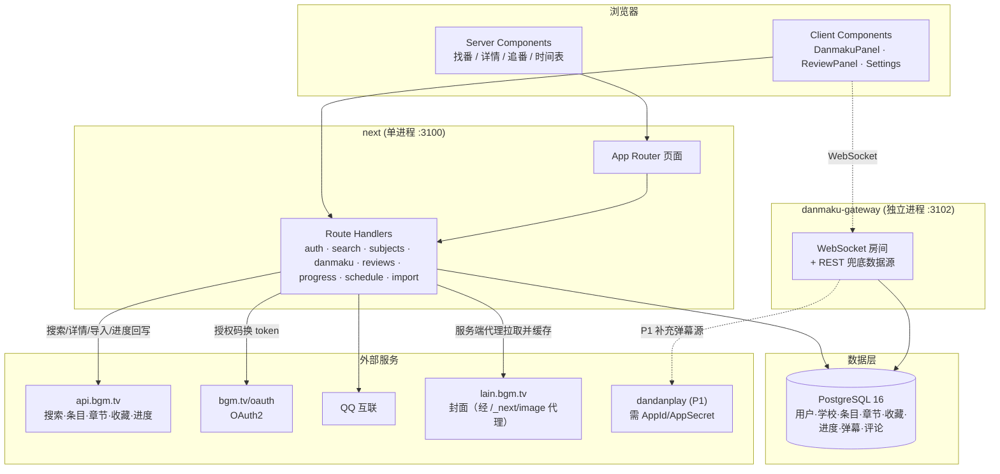

# hit-ani 技术方案与初版（MVP）范围决策稿

> 目标：基于 Bangumi 数据，为校内做「找番 / 看番 / 追番」一站式 Web 平台。
> 校内用户注册后可绑定 QQ 与 Bangumi 账号，一键导入 BGM 全部收藏与进度，
> 并能在应用内按「本校学生」维度快速筛选弹幕 / 评论 / 影评。
>
> 本文档为**问答式决策稿**：先给结论，再给证据与理由。

---

## 0. 结论速览

| 维度 | 决策 | 理由（一句话） |
| --- | --- | --- |
| 前端 | Next.js 15 App Router + TypeScript + Tailwind v4（手写组件，**未引入 shadcn/ui**） | SSR 直出，弹幕/评论面板才走客户端组件；避免为几个组件引入整套 UI 依赖 |
| 后端 | Next.js Route Handlers 兼作 API —— **没有独立业务服务进程** | 业务 API 与 SSR 同栈，少一个进程少一份运维；只有弹幕被 WS 特性逼成独立进程 |
| 实时层 | 独立 Node 进程 `danmaku-gateway`（`ws` 库，原生 WebSocket，非 Socket.IO） | 长连接 + 常驻内存广播，Serverless 跑不了 |
| 数据库 | PostgreSQL 16 + Prisma | 关系型模型清晰，迁移与类型安全成本最低 |
| 缓存/限流 | 进程内令牌桶（**无 Redis**） | 单校量级无需引入 Redis；多副本部署时的替换点已在 §8 标明 |
| 认证 | 自建账号（scrypt）+ QQ 互联 + Bangumi OAuth2 | 三方按「绑定」而非「登录身份」建模，`schoolId` 由邮箱域名解析 |
| 搜索 | 直通 Bangumi `POST /v0/search/subjects`，**本地不建索引** | 条目搜索上游已足够好；本地只缓存命中过的条目 |
| BGM 类型 | `openapi-typescript` 从 `.bgm-v0.yaml` 生成 | 杜绝手写 interface 随 API 漂移 |
| 封面 | 经 Next.js `/_next/image` 服务端代理并缓存 | 不把校内用户 IP 交给第三方，也不受上游 referer 限制 |
| 部署 | VPS / Railway / Render（**不用 Vercel**） | 弹幕网关是长连接常驻进程，Serverless 跑不了 |
| 视频源 | **不做片源托管**，只做找番/追番/弹幕/评论 | 规避版权与带宽风险 |

---

## 1. 已核实的 Bangumi API 能力边界（本方案的地基）

以下均为**实测 / 规范原文**结论，非推测。

| 能力 | 端点 | 可用性 | 证据 |
| --- | --- | --- | --- |
| 条目搜索（关键词/标签/评分/日期/排名） | `POST /v0/search/subjects` | ✅ 无需 token | 实测 `keyword=魔法, type=[2]` → `total=444` |
| 条目详情 | `GET /v0/subjects/{subject_id}` | ✅ | `open-api/v0.yaml` |
| 章节（episode）列表 | `GET /v0/episodes?subject_id=` | ✅ | 实测返回 `airdate/name/name_cn/duration/desc` |
| 用户收藏（公开） | `GET /v0/users/{username}/collections` | ✅ 无需 token | 实测 `/v0/users/sai/collections?subject_type=2` 返回数据 |
| 收藏进度（批量） | `GET/PATCH /v0/users/-/collections/{subject_id}/episodes` | ⚠️ 需 `write:collection` | 规范 `security` 段 |
| 单集进度 | `GET/PUT /v0/users/-/collections/-/episodes/{episode_id}` | ⚠️ 需 `write:collection` | 规范 `security` 段 |
| 收藏短评 | `POST /v0/users/-/collections/{subject_id}` 的 `comment` 字段 | ⚠️ **仅自己的、单条字符串** | 规范 schema `UserSubjectCollectionModifyPayload` |
| **弹幕** | — | ❌ **BGM API 完全不提供** | `v0.yaml` 全部 tag 仅：条目/章节/角色/人物/用户/收藏/编辑历史/目录 |
| **他人评论列表** | — | ❌ **已下线** | `GET /ep/8/comments` → `{"code":404}` |
| **他人影评列表** | — | ❌ **已下线** | `GET /subject/8/reviews` → `{"code":404}` |
| OAuth 授权码模式 | authorize `https://bgm.tv/oauth/authorize`，token `https://bgm.tv/oauth/access_token` | ✅ | `docs-raw/How-to-Auth.md` |
| Token 有效期 | `expires_in: 604800`（7 天），支持 `refresh_token` 续期 | ✅ | 同上 |
| 认证域名 ≠ API 域名 | 授权走 `bgm.tv`，业务走 `api.bgm.tv` | ✅ | 同上（易踩坑） |
| User-Agent | 必须按官方建议设置 | ✅ | `docs-raw/user agent.md` |

### 1.1 由此得到的三条硬约束

1. **弹幕必须自建。** BGM 在 `v0` 里没有任何弹幕接口，旧版 `/ep/{id}/comments` 也已 404。
   这恰恰是本校平台的核心差异化点 → 必须作为**独立模块**，不能被「BGM API 驱动」隐式吞掉。
2. **评论 / 影评必须自建。** BGM 只允许你写自己收藏的那一条 `comment` 字符串，读不到别人的评论列表。
   → 校内评论/影评表结构完全自主设计。
3. **BGM 只提供「元数据 + 你自己的收藏/进度」**，即：条目、章节、标签、评分、时间表、导出你的收藏与进度。
   平台的价值增量 = **校内社交层（弹幕/评论/影评 × 学校维度筛选）**。

### 1.2 弹幕聚合源：dandanplay

- Animeko 的弹幕来自「自建服务 + 弹弹play（dandanplay）聚合」。
- 实测 `https://api.dandanplay.net/api/v2/*` → `403 Missing Authentication Headers`，
  需申请 **AppId / AppSecret** 并以 `X-AppId` / `X-AppSecret` 请求头调用。
- 结论：dandanplay 可作为 **P1 的「公网弹幕」补充层**，但**不能**作为本校弹幕的基础设施；
  本校弹幕的第一方存储与筛选必须先做（P0）。

### 1.3 弹幕数据模型（对齐 Animeko 源码，便于未来复用/迁移）

Animeko 的弹幕模型（`danmaku/api/src/commonMain/kotlin/DanmakuInfo.kt`）：

```
DanmakuInfo {
  id: String
  serviceId: "Animeko" | "Dandanplay" | "Bilibili" | "Baha" | "Acfun" | "Tucao"
  senderId: String
  content: {
    playTimeMillis: Long   // 毫秒时间轴
    color: Int             // RGB
    text: String
    location: TOP | BOTTOM | NORMAL   // NORMAL = 滚动
  }
}
```

我们直接沿用该结构（外加 `schoolId` 维度），既贴合主流弹幕生态，也为将来客户端复用留路。

---

## 2. 架构决策（问答）

### Q1：这是单体还是微服务？
**A：MVP 用「模块化单体 + 一个独立的弹幕进程」。**
- 校内量级（目标 < 10k 用户，峰值并发弹幕房间 < 500）单体 Postgres 完全够。
- 唯一必须独立的进程是**弹幕网关**：长连接、常驻内存、广播逻辑与 SSR 生命周期完全不同。
- 模块边界按业务切：`auth` / `bgm` / `subject` / `collection` / `danmaku` / `review`。

### Q2：登录体系怎么设计？
**A：自建账号为准，QQ 与 BGM 都是「绑定」而非「登录即账号」。**

```
User (本平台账号)
 ├── 学校邮箱 / 学号   ← 主身份（决定 schoolId 白名单）
 ├── QQ 绑定            ← 站内通知、加群引导
 └── BGM 绑定           ← 一键导入收藏与进度（存 access/refresh token）
```

- BGM OAuth2 授权码模式，`code` 有效期仅 60s，`access_token` 有效期 7 天 → **必须落库 refresh_token 并做后台定时刷新**。
- 学校维度：注册时校验邮箱域名 / 学号白名单，写入 `schoolId`，这是「只看本校弹幕」的根基。

### Q3：BGM 收藏导入怎么做？
**A：分页拉取 + 落库缓存 + 增量刷新。**
- 入口：`GET /v0/users/{username}/collections`（公开可读）+ 授权后读私有收藏。
- 每个条目的分集进度：`GET /v0/users/-/collections/{subject_id}/episodes`（需授权）。
- 全量导入放后台任务，避免阻塞请求（BGM 限流未知，需保守 QPS + 指数退避）。
- 落库后**业务读走本地**，BGM 只作同步源 → 降低对上游的依赖与延迟。

### Q4：弹幕服务怎么设计？
**A：自建，REST 拉取 + WebSocket 实时，按 `episodeId` 分房间。**

- 存储：`Danmaku(episodeId, playTimeMs, text, color, location, userId, schoolId, createdAt, status)`
- 拉取：`GET /api/danmaku?episodeId=&fromMs=&toMs=&schoolOnly=` → 时间窗内弹幕（首屏）
- 实时：`WS /danmaku/room/{episodeId}?schoolOnly=true` → 加入时 `repopulate` 首屏，之后 `add` 增量
- 筛选：`schoolOnly=true` 命中复合索引 → **本校弹幕是查询条件，不是后置过滤**
- 反滥用：每条弹幕绑定 `userId` + 令牌桶限流（突发 5 条，之后 30 秒 1 条）+ 长度上限
- 轨道由前端排布（`allocateTracks`，与 Animeko 的分工一致），服务端只管存取
- **降级路径**：网关不可用时前端自动切 REST 模式，避免「看番」链路整体失效

### Q5：看番（片源）做不做？
**A：不做片源托管。**
- 理由：片源自托管 = 版权风险 + 带宽成本，且与「校内动漫平台」的核心价值（社交层）无关。
- 现状：弹幕渲染层已完整实现（canvas + 轨道算法 + 颜色/位置），
  接入任何播放器后即可直接挂载；播放器与片源留到 P1/P2。

### Q6：能不能全压在 Vercel？
**A：不能。**
- 弹幕 WebSocket = 长连接常驻进程，Serverless 函数有时长上限且无持久连接。
- 方案：SSR + API 同机（或 Vercel），**弹幕网关必须放 Railway / Render / VPS**。
- 单机部署：一台 VPS 跑 `next start -p 3100` + `npm run gateway` + `postgres` 即可。

### Q7：搜索用什么？
**A：直通 Bangumi 搜索接口，本地不建索引。**
- 条目检索由 `POST /v0/search/subjects` 承担（支持标签/评分/日期/排名筛选），已实测可用。
- 本地只缓存「用户点进详情」的条目，避免为搜索单独维护索引。
- 触发升级条件：BGM 搜索出现可用性问题，或需要对本地数据（弹幕/评论）做全文检索时，
  再引入 Postgres `pg_trgm` / Meilisearch。

---

## 3. 系统架构



> 与初版草案的差异：**没有 NestJS，没有 Redis**。业务 API 与 SSR 同进程，
> 只有弹幕网关因 WebSocket 特性独立。Redis 只在网关多副本时才需要（见 §8）。

---

## 4. 数据模型（Prisma 草案）

```prisma
model User {
  id         String   @id @default(cuid())
  email      String?  @unique      // 学校邮箱
  studentNo  String?  @unique      // 学号
  schoolId   String                 // 学校维度筛选的根基
  nickname   String
  avatarUrl  String?
  createdAt  DateTime @default(now())

  qqBinding   QqBinding?
  bgmBinding  BgmBinding?
  danmakus    Danmaku[]
  reviews     Review[]
}

model QqBinding {
  userId    String @id
  openId    String @unique
  unionId   String?
  user      User   @relation(fields: [userId], references: [id], onDelete: Cascade)
}

model BgmBinding {
  userId       String @id
  bgmUserId    Int    @unique      // BGM user_id
  bgmUsername  String
  accessToken  String
  refreshToken String
  expiresAt    DateTime            // 7 天有效期，需定时刷新
  syncedAt     DateTime?
  user         User   @relation(fields: [userId], references: [id], onDelete: Cascade)
}

model Subject {                    // BGM 条目本地缓存
  id         Int      @id          // BGM subject_id
  type       Int
  name       String
  nameCn     String?
  summary    String?
  coverUrl   String?
  airDate    DateTime?
  score      Float?
  rank       Int?
  tags       String[]
  updatedAt  DateTime @updatedAt
  episodes   Episode[]
  reviews    Review[]
}

model Episode {
  id         Int     @id           // BGM episode_id
  subjectId  Int
  sort       Float
  ep         Float?
  name       String
  nameCn     String?
  airdate    DateTime?
  duration   String?
  subject    Subject @relation(fields: [subjectId], references: [id], onDelete: Cascade)
  danmakus   Danmaku[]
}

model Collection {                 // 用户收藏（BGM 导入 + 本地修改）
  id        String   @id @default(cuid())
  userId    String
  subjectId Int
  type      Int                    // 1想看 2看过 3在看 4搁置 5抛弃（注意 2/3 顺序反直觉）
  comment   String?
  rating    Int?
  updatedAt DateTime @updatedAt
  @@unique([userId, subjectId])
  @@index([subjectId, type])
}

model EpisodeProgress {
  id          String   @id @default(cuid())
  userId      String
  episodeId   Int
  type        Int                  // 0未看 1想看 2看过 3抛弃
  updatedAt   DateTime @updatedAt
  @@unique([userId, episodeId])
  @@index([episodeId])
}

/// 自建弹幕 —— 平台核心差异化的载体
model Danmaku {
  id         String   @id @default(cuid())
  episodeId  Int
  userId     String
  schoolId   String
  playTimeMs Int                   // 时间轴（毫秒）
  text       String
  color      Int      @default(16777215)
  location   Int      @default(0)  // 0=NORMAL 1=TOP 2=BOTTOM
  status     Int      @default(0)  // 0正常 1屏蔽 2已删除
  createdAt  DateTime @default(now())

  @@index([episodeId, playTimeMs])
  @@index([episodeId, schoolId, playTimeMs])   // 本校筛选的关键索引
}

model Review {                     // 评论 / 影评
  id        String   @id @default(cuid())
  userId    String
  subjectId Int
  kind      Int                    // 0短评 1长评(影评)
  title     String?
  content   String
  rating    Int?                   // 1-10
  schoolId  String
  likes     Int      @default(0)
  createdAt DateTime @default(now())

  @@index([subjectId, schoolId])
  @@index([subjectId, createdAt])
}
```

---

## 5. 初版（MVP）功能清单与实现状态

> 本节同时是交付验收表：`状态` 列以仓库当前代码 + `npm test` / `npm run smoke` 的实际结果为准。

### P0 — 初版发行版

| # | 模块 | 功能 | 验收标准 | 状态 |
| --- | --- | --- | --- | --- |
| F1 | 账号 | 学校邮箱/学号注册登录 | 非白名单域名 403；`schoolId` 由邮箱域名解析，客户端不可传 | ✅ |
| F1b | 绑定 | 绑定 QQ、绑定 BGM（OAuth2 + state 防 CSRF） | 绑定状态在设置页可见、可解绑 | ✅ 代码完成，需自备应用凭据联调 |
| F2 | BGM 导入 | 一键导入全部收藏 + 每集进度 | 导入接口返回 subjects/episodes/collections/progress 统计；幂等可重跑 | ✅ 代码完成，需 BGM 凭据联调 |
| F3 | 找番 | 关键词搜索、标签/排序筛选、条目详情、章节列表 | 搜索命中 `POST /v0/search/subjects`；详情页含章节与弹幕密度 | ✅ |
| F4 | 追番 | 五分组看板（想看/在看/看过/搁置/抛弃）+ 状态站内可改 + 单集进度 + 回写 BGM | 状态本地落库并镜像 BGM；分组计数正确；进度失败仅告警不阻断 | ✅ |
| F5 | 校内评论/影评 | 短评 + 长评 + 评分，支持「只看本校」 | `schoolOnly` 生效且跨校隔离（冒烟已断言） | ✅ |
| F7 | 时间表 | 每周新番时间表（可前后翻周） | 按 `air_date` 区间检索聚合，7 天分组 | ✅ |

P0 全部完成。`✅ 代码完成，需自备应用凭据联调` 的两项（QQ / BGM 绑定与导入）无法在没有真实
应用凭据的沙箱里端到端验证，其余各项均由 `npm run smoke` 的真实链路断言覆盖。

### P1 — 快速跟进（尚未实现）

- 弹幕云过滤（关键词 / 正则 / 屏蔽用户）
- 弹幕举报与审核后台
- 关注 / 好友、收藏动态流
- 接入 dandanplay 作为「公网弹幕」补充源（需先申请 AppId/AppSecret）
- 播放器集成（ArtPlayer/DPlayer）——弹幕渲染层已具备（`DanmakuPanel` 的 canvas + 轨道算法）

### P2 — 后续

- 片源聚合与在线播放（需评估版权）
- 移动端（React Native / Tauri / Compose Multiplatform）
- 离线缓存、推荐算法

### 明确不做（MVP）

- ❌ 视频文件托管 / BT 做种（版权 + 带宽风险）
- ❌ 弹幕云端转码、AI 生成
- ❌ 多学校联邦（先单校跑通，`schoolId` 预留）

---

## 6. 部署拓扑与成本

```
[VPS / Railway]
 ├── next (SSR + API)        :3100   ← 生产可改回 80/443 反代
 ├── danmaku-gateway (WS)    :3102   ← 必须常驻，不可 Serverless
 └── postgres:16             :5432
```

> 早期草案里的独立 NestJS 进程与 Redis 被**去掉**了：业务 API 直接由 Next.js Route Handlers
> 承担，弹幕限流在当前单校量级用进程内令牌桶即可。只有弹幕网关保留了独立进程 ——
> 这是被 WebSocket 的常驻长连接特性所迫，其余「微服务化」在校内规模下只是运维负担。

- 最低配 2C4G 可支撑校内规模。
- 反向代理（Caddy/Nginx）负责 TLS，并把 `/danmaku/room/*` 升级转发到网关。
- 生产必须替换 `SESSION_SECRET`，并把 `NEXT_PUBLIC_DANMAKU_WS_URL` 指向 `wss://<域名>`。

---

## 7. 风险与合规

| 风险 | 影响 | 对策 |
| --- | --- | --- |
| BGM API 限流未知 | 导入任务失败 | 后台任务 + 指数退避 + 本地缓存优先 |
| BGM API 变更 | 类型漂移 | 类型由 `.bgm-v0.yaml` 生成；规范文件纳入版本控制 |
| 弹幕内容违规 | 平台责任 | 绑定实名用户 + 举报 + 屏蔽词 + 审核队列 |
| 片源版权 | 法律风险 | MVP 不做片源托管 |
| OAuth token 泄露 | 账号安全 | 加密存储、最小权限、定期刷新 |

---

## 8. 里程碑与完成情况

| # | 里程碑 | 状态 |
| --- | --- | --- |
| M1 | 地基：仓库骨架、Prisma schema、BGM 类型生成、BGM 客户端只读打通 | ✅ |
| M2 | 账号：注册登录、QQ 绑定、BGM OAuth 绑定、收藏一键导入 | ✅ 代码完成（联调需应用凭据） |
| M3 | 找番追番：搜索页、详情页、收藏看板、进度标记、时间表 | ✅ |
| M4 | 弹幕：弹幕表 + REST 拉取 + WS 房间 + 校内筛选 | ✅ |
| M5 | 社区：评论/影评 + 校内筛选 | ✅（举报与屏蔽词审核队列未做，见 P1） |
| M6 | 发射：部署、压测、灰度 | ⏳ 未做 |

### 上线前仍必须处理

1. **UGC 审核**：弹幕 / 评论目前只有长度与频率限制，没有敏感词与举报流程 —— 校内平台上线前
   必须补齐，否则风险落在运营方。
2. **多实例部署**：弹幕限流是进程内令牌桶（`src/lib/danmaku/rate-limit.ts`），
   一旦网关起多副本，需要换成 Redis 共享计数；房间广播也需要跨实例通道（Redis Pub/Sub）。
3. **未验证项**：QQ / BGM 两条 OAuth 绑定链路与全量导入只能在没有真实应用凭据时跑通代码路径，
   上线前需用真实凭据各走一遍完整流程。

---

## 9. 后续路线：视频获取 / 播放 / 弹幕源

详见 [`docs/MEDIA.md`](./MEDIA.md)（Animeko 源码调研 + hit-ani 设计决策）。要点：

- **视频源**：Animeko 的「在线聚合源」本质是**订阅源配置 + CSS selector/RSS 抓取**，不是私有播放 API
  → hit-ani 可完全自研同类能力（`SelectorMediaSource` / `RssMediaSource` 等价物）
- **不做**：BT 引擎、视频托管、VideoWebView 验证码链路（理由见 MEDIA.md §6.2）
- **弹幕源**：dandanplay 需 AppId/AppSecret，签名 `Base64(SHA256(appId+ts+path+secret))`；
  其**匹配降级链**已实现为 `src/lib/danmaku/matching.ts`（纯逻辑、可测试，无需凭据）
- **播放器**：核心约束是**分离「媒体时钟」与「渲染时钟」** —— 弹幕位移用 rAF 时间戳，
  发弹幕时机用 `video.currentTime`；倍速**不补偿**弹幕速度（对齐 Animeko）
